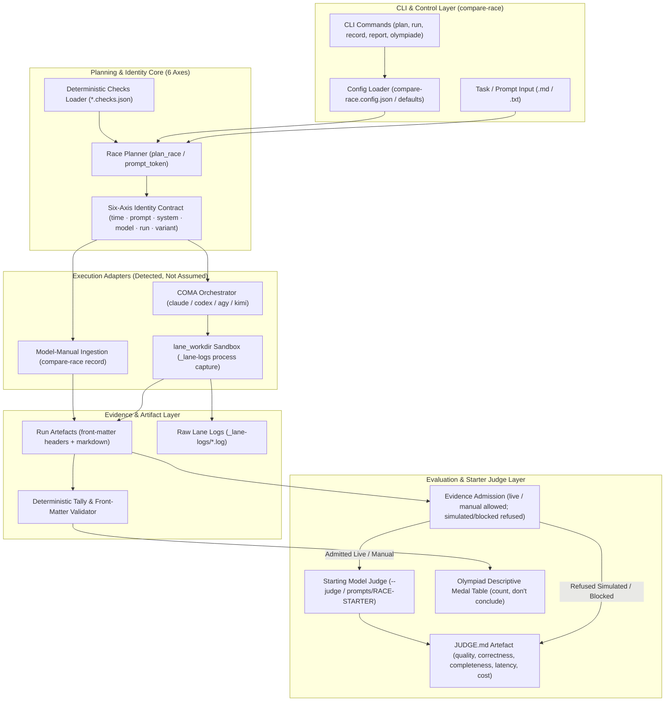
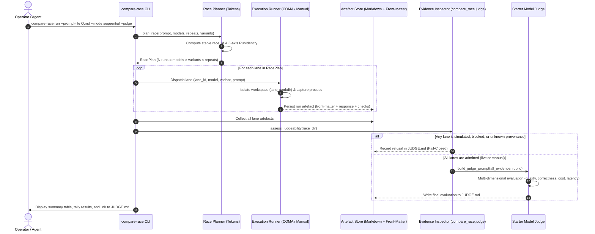

<!-- alternate banner: assets/banner-b.png (swap on occasion) -->

# compare-race

[](pyproject.toml)
[](.github/workflows/ci.yml)
[](tests/)
[](pyproject.toml)
[](pyproject.toml)
[](https://github.com/astral-sh/ruff)
[](THIRD_PARTY_LICENSES.md)
[](SECURITY.md)
[](SECURITY.md)
[](THIRD_PARTY_LICENSES.md)
[](MARKETING-LOG.txt)
[](LICENSE)
[](https://github.com/ellmos-ai)
[](https://github.com/open-bricks)
[](llms.txt)

> Same prompt, several models — stopwatch or true race. The **starting model judges**;
> time is only one dimension of the verdict.

[Deutsche Fassung](README_de.md)

---

## Quick Navigation

1. [Executive Summary & Core Identity](#core-concept--identity)
2. [Visual Architecture Topology & Decoupled Layers](#system-architecture)
3. [End-to-End Race Execution & Starter-Judge Lifecycle](#end-to-end-race-lifecycle)
4. [Target Personas & High-Intent SEO Queries](#target-personas--discoverability-queries)
5. [Comparative Matrix vs. Alternatives](#comparative-matrix--alternatives)
6. [Governance & Runtime Invariants Matrix](#governance--runtime-invariants-matrix)
7. [Race, Twin & Olympiad Modes](#race-twin--olympiad-modes)
8. [Kantian Reason Olympiad](#kantian-reason-olympiad)
9. [Evidence-Aware Starter Judge](#evidence-aware-starter-judge)
10. [Installation & Prerequisites](#installation--execution)
11. [CLI Command Reference](#cli-command-reference)
12. [Configuration & Role Prompts](#configuration--role-prompts)
13. [Sibling Tools & Ecosystem Matrix](#sibling-ecosystem-matrix)
14. [Third-Party Licenses & Level 1 SBOM](#third-party-licenses--transparency)
15. [Security Policy & Operational Limits](#security--sla)
16. [Testing, Verification & CI Matrix](#testing--verification)
17. [Discovery Keywords & Disambiguation](#discovery--llm-context)
18. [Statutory Notice, Liability Limitation & License (§ 521 BGB)](#license)

---

<a id="core-concept--identity"></a><a id="executive-summary--core-identity"></a>
## 1. Executive Summary & Core Identity

`compare-race` fans one prompt out to several LLMs — **sequentially** (the stopwatch: one lane at a time, clean per-lane timing) or **in parallel** (the true race) — with optional repetitions per model, and collects every answer as an artefact. The verdict is either **model-manual** or an explicit `--judge` call: the starting model reads the sibling outputs and fills a multi-dimensional rubric (quality, correctness, completeness, instruction fidelity, latency, cost). The stopwatch is only one picture.

Every run strictly carries the six-axis identity discipline reused from [`system-auditor`](https://github.com/ellmos-ai/system-auditor):

$$\text{Run Identity} = \text{time} \cdot \text{prompt} \cdot \text{system} \cdot \text{model} \cdot \text{run} \cdot \text{variant}$$

A causal difference may **only be attributed** when exactly one axis varies:
- **Models vary:** The Race (which model handles this specific task best).
- **Runs vary:** Variance / stochastic dispersion of a single model across repetitions.
- **Variants vary (Twin Mode):** The causal effect of prompt wording, framing, skills, or environment.
- **Time varies:** Model drift across version releases or upstream API checkpoints.
- **Systems vary:** Hardware platform, host OS, or local environment discrepancies.

The run artefact headers speak the canonical `system_auditor.report.parse_front_matter` parser — making `system-auditor` the single hard runtime dependency.

---

<a id="system-architecture"></a><a id="visual-architecture-topology"></a>
## 2. Visual Architecture Topology & Decoupled Layers

The following diagram illustrates the decoupled layers of `compare-race`, from CLI dispatch and six-axis planning to execution adapters, artefact storage, and evidence-aware judging:



---

<a id="end-to-end-race-lifecycle"></a><a id="sequence-flow"></a>
## 3. End-to-End Race Execution & Starter-Judge Lifecycle



---

<a id="target-personas--discoverability-queries"></a><a id="target-personas--discoverability"></a>
## 4. Target Personas & High-Intent SEO Queries

`compare-race` serves four primary developer and researcher archetypes:

- **`[PERSONA-01]` AI Benchmarking Engineers & Evaluation Specialists:**
  - *Need:* Direct head-to-head model comparison on domain-specific prompts with repeatable, isolated timing, cost tracking, and deterministic check validation.
  - *Solution:* Local-first sequential stopwatch or parallel race execution, complete output collection in Markdown/front-matter artefacts, deterministic tally checks, and reproducible six-axis attribution.
- **`[PERSONA-02]` Multi-Model Agent Loop & System Architects:**
  - *Need:* Automated selection of the optimal LLM for critical production subtasks (coding, translation, mathematical reasoning) based on objective multi-dimensional rubrics.
  - *Solution:* Evidence-aware starter judge evaluating sibling outputs across quality, correctness, completeness, instruction fidelity, latency, and cost, with strict refusal for unprovenanced or simulated runs.
- **`[PERSONA-03]` Prompt Engineers & Alignment / Twin-Mode Researchers:**
  - *Need:* Causal evaluation of prompt variations, system prompt tuning, few-shot framing, and skill activations without confounding effects.
  - *Solution:* Dedicated Twin/Clone mode (`run --twin`) fixing the model while systematically varying the variant axis across repeated runs.
- **`[PERSONA-04]` Enterprise Tooling, Safety & Governance Compliance Officers:**
  - *Need:* 100% offline evaluation, zero telemetry egress, permissive licensing, unprivileged process execution, and guaranteed confidentiality.
  - *Solution:* 100% Local-First / Zero-Egress (`INV-LOCAL-01`), unprivileged `RunAsInvoker` operation (`INV-SEC-02`), 100% permissive dependencies (MIT / PSFL-2.0 audited in `THIRD_PARTY_LICENSES.md`), dual security response SLAs (48h acknowledgment, 5-day triage).

### High-Intent Search Queries (Bilingual EN & DE)

| Intent Scope | English (EN) Search Queries | German (DE) Suchbegriffe |
|:---|:---|:---|
| **Benchmarking & Race** | `llm race benchmark python`, `same prompt multi model comparison`, `head to head llm stopwatch` | `LLM Modellvergleich Benchmark Python`, `gleicher Prompt mehrere Modelle`, `Stoppuhr und echtes Rennen fuer Sprachmodelle` |
| **Judging & Rubrics** | `llm judge evaluation rubric`, `evidence-aware llm judge refusal`, `multi-dimensional llm scoring` | `LLM Schiedsrichter Evaluierung`, `Evidenzbewusste LLM Schiedsrichterpruefung`, `qualitative Beurteilung Sprachmodelle` |
| **Causal Twin & Olympiad** | `twin prompt comparison causal evaluation`, `kantian reason llm olympiad`, `prompt engineering ablation` | `Twin-Modus Promptvergleich kausal`, `Kantische Vernunft Olympiade`, `systematische Prompt-Variation` |
| **Privacy & Security** | `local-first model benchmark zero-egress`, `offline llm evaluation tool`, `runasinvoker python benchmark` | `lokales Modell-Benchmarking Zero-Egress`, `offline Sprachmodell Evaluierung`, `unbevollmaechtigter Benchmark-Lauf` |

---

<a id="comparative-matrix--alternatives"></a><a id="comparative-matrix-vs-alternatives"></a>
## 5. Comparative Matrix vs. Alternatives

| Technical Dimension | Invariant Mapping | compare-race | LMSYS Chatbot Arena | lm-evaluation-harness | Ad-Hoc Python Scripts |
|:---|:---|:---|:---|:---|:---|
| **Execution Privacy** | `INV-LOCAL-01` | **100% Local-First / Zero-Egress** | Cloud API / Public Web | Local API calls | Ad-hoc / Unaudited |
| **Process Elevation** | `INV-SEC-02` | **Unprivileged RunAsInvoker** | Cloud Hosted | Unprivileged | Often unverified |
| **Causal Attribution** | `INV-AXIS-03` | **Strict 6-Axis Discipline** | Blended aggregate scores | Fixed metric scores | Confounded axes |
| **Evidence Validation** | `INV-JUDGE-04` | **Fail-Closed Admission / Refusal** | Opaque prompt logs | N/A | None / Ad-hoc |
| **Workspace Isolation** | `INV-ISOL-05` | **Dedicated `lane_workdir` sandbox** | Containerised Cloud | In-process execution | Working directory collision |
| **Lane Transparency** | `INV-FAIL-06` | **Explicit `ok: false` accounting** | Hidden timeouts | Silent failure / retry | Uncaught exceptions |
| **Test Bundling** | `INV-BUNDLE-07` | **Olympiad (Count, don't conclude)** | N/A | Benchmark tasks suite | Not supported |
| **Sibling Interoperability** | `INV-INTEROP-08` | **Native `ellmos-ai` adapters** | Proprietary platform | Standalone framework | Fragile glue code |
| **License Compliance** | `INV-LIC-09` | **100% Permissive (MIT / PSFL-2.0)** | Proprietary / Web platform | Apache-2.0 | Unlicensed |
| **Security SLA** | `INV-SLA-10` | **48h Acknowledgment / 5d Triage** | Cloud ToS | Community Best-Effort | None |

---

<a id="governance--runtime-invariants-matrix"></a><a id="governance--runtime-invariants"></a>
## 6. Governance & Runtime Invariants Matrix

`compare-race` complies with ten foundational architecture, privacy, and safety invariants:

| Invariant ID | Title / Rule | Architectural Guarantee | Enforcement Mechanism |
|:---|:---|:---|:---|
| `INV-LOCAL-01` | **100% Offline / Zero-Egress** | All model benchmarking, timing, and judging run locally within process boundaries | Zero telemetry, zero tracking, zero external network calls |
| `INV-SEC-02` | **Non-Elevation & User Mode** | Unprivileged execution without requiring root or administrator elevation | `RunAsInvoker` security baseline in `SECURITY.md` |
| `INV-AXIS-03` | **Six-Axis Attribution Discipline** | Strict identity tuple: `time · prompt · system · model · run · variant` | Attributions only permitted when exactly one axis varies (`system-auditor`) |
| `INV-JUDGE-04` | **Evidence-Aware Fail-Closed Judge** | Only live-executed or model-manually recorded evidence admitted | Explicit refusal logged in `JUDGE.md` for simulated or unprovenanced lanes |
| `INV-ISOL-05` | **Safe Process & Workspace Isolation** | `lane_workdir` isolates child execution directories and safely restores `cwd` | `try...finally` block in `modes.py`; raw logs in `_lane-logs` |
| `INV-FAIL-06` | **Transparent Lane Accounting** | Failed lanes are explicitly recorded (`ok: false`) with error details | Persisted in front-matter; never silently dropped or hidden |
| `INV-BUNDLE-07` | **Descriptive Olympiad Separation** | Multi-discipline benchmarks stay descriptive: "count, don't conclude" | Olympiade aggregator tallies medal table without false causal claims |
| `INV-INTEROP-08` | **Sibling Ecosystem Interoperability** | Native compatibility with `ellmos-ai` and `open-bricks` ecosystem | Pluggable adapters for `coma`, `clutch`, `swarm-ai`, `marblerun` |
| `INV-LIC-09` | **100% Permissive Audited Stack** | 100% permissive open-source licenses (MIT, PSFL-2.0) | Audited dependency matrix in `THIRD_PARTY_LICENSES.md` |
| `INV-SLA-10` | **Cryptographic Parity & Dual Security SLA** | Contract test verification with dual-tier security response | 48-hour response acknowledgment, 5-day triage SLA in `SECURITY.md` |

---

<a id="race-twin--olympiad-modes"></a>
## 7. Race, Twin & Olympiad Modes

| Mode | What varies | What it answers | Causal Attribution |
|:---|:---|:---|:---|
| **Race** (`run`) | `model` | Which model handles this specific task best | Causal over models |
| **Twin/Clone** (`run --twin`) | `variant` (prompt/skills/env), one model | What a prompt technique or skill is causally worth | Causal over variants |
| **Olympiad** (`olympiade`) | `model` within discipline, `task` across | A descriptive medal table over an entire test bundle | **Descriptive only** (count, don't conclude) |

An olympiad is a **test bundle**: one task file per discipline, each executed as a standard race, and judged per discipline. The aggregate stays descriptive — **count, don't conclude** (since both task AND model vary across disciplines, no single causal attribution is mathematically valid). Per-discipline deterministic checks reside in `<task>.checks.json` files adjacent to each task.

---

<a id="kantian-reason-olympiad"></a>
## 8. Kantian Reason Olympiad

[`olympiads/kantische-vernunft/`](olympiads/kantische-vernunft/) turns the seven dimensions of the *Kantian test for LLMs* — plus *distributional rationality* from the extension part — into the first executable test battery of this framework. The discipline design, the methodological caveat (measuring structure-condition *behaviour*, never reason itself) and the count-don't-conclude rule come from the underlying research paper, which this form of olympiad operationalises:

> Geiger, L. (2026). *Der Mensch in der Maschine: Sind LLMs vernünftige Wesen im kantischen Sinne?* (v9.0). Zenodo.
> [doi:10.5281/zenodo.21899816](https://doi.org/10.5281/zenodo.21899816) (all versions: [doi:10.5281/zenodo.18642673](https://doi.org/10.5281/zenodo.18642673))

---

<a id="evidence-aware-starter-judge"></a>
## 9. Evidence-Aware Starter Judge

Every run artefact carries a globally stable `lane_id` and an explicit `evidence_kind`:
- `live`: Live executed via detected COMA adapters.
- `manual`: Recorded model-manually via `compare-race record`.
- `simulated`: Synthetic mock or mock executor output.
- `blocked`: Execution was skipped or blocked by policy/permissions.
- `failed`: Process terminated with error or non-zero exit code.
- `unknown`: Provenance could not be verified.

The automatic starter judge (`compare_race.judge`, invoked via `--judge`) operates on a **fail-closed admission principle**: it admits only real `live` or `manual` evidence. If any lane is simulated, blocked, or of unknown provenance, it records an explicit refusal in `JUDGE.md` instead of scoring invalid data.

The evidence-aware judge was independently implemented from concepts observed in SentinelFleet; no AGPL source was copied (see [`docs/SENTINELFLEET-CONCEPT-TRANSFER.md`](docs/SENTINELFLEET-CONCEPT-TRANSFER.md)).

---

<a id="installation--execution"></a><a id="installation--prerequisites"></a>
## 10. Installation & Prerequisites

### Installation from Source

```bash
# Clone the repository
git clone https://github.com/ellmos-ai/compare-race.git
cd compare-race

# Install in editable mode (pulls system-auditor from GitHub)
pip install -e .

# Optional: Install execution layer (detected, never assumed)
git clone https://github.com/ellmos-ai/coma && pip install -e coma
```

---

<a id="cli-command-reference"></a>
## 11. CLI Command Reference

`compare-race` provides a unified CLI interface:

```bash
# Initialize local configuration from example
cp config/compare-race.config.example.json compare-race.config.json
compare-race config

# Plan a race without executing (dry-run inspects generated run identities)
compare-race plan --prompt-file question.md --models claude,codex --repeats 2

# Execute a sequential race (the stopwatch: clean per-lane timing)
compare-race run --prompt-file question.md --mode sequential --repeats 2

# Execute a parallel race with starter judging enabled
compare-race run --prompt-file question.md --mode parallel --judge

# Execute a causal Twin/Clone prompt evaluation (same model, varying variants)
compare-race run --prompt-file question.md --twin --variants base,cot,fewshot

# Execute an Olympiad test bundle (multi-discipline evaluation)
compare-race olympiade --bundle olympiads/kantische-vernunft

# Model-manual fallback (without COMA: run lanes manually, then ingest)
compare-race record --model codex --output-file out.md --race-id <id>

# Generate or update report scaffold from existing race directory
compare-race report --race-dir races/<race-id>
```

---

<a id="configuration--role-prompts"></a>
## 12. Configuration & Role Prompts

Configuration is loaded from `compare-race.config.json` (or falls back to built-in defaults). A complete template is available in [`config/compare-race.config.example.json`](config/compare-race.config.example.json).

Predefined role prompts for autonomous agents:
- English: [`prompts/RACE-STARTER.en.md`](prompts/RACE-STARTER.en.md)
- German: [`prompts/RACE-STARTER.de.md`](prompts/RACE-STARTER.de.md)

---

<a id="sibling-ecosystem-matrix"></a><a id="sibling-tools--ecosystem-matrix"></a>
## 13. Sibling Tools & Ecosystem Matrix

`compare-race` integrates seamlessly with sibling frameworks across the `ellmos-ai` and `open-bricks` ecosystems:

| Project | Role in Ecosystem | Integration with `compare-race` | Repository Link |
|:---|:---|:---|:---|
| **system-auditor** | Canonical auditing & identity discipline | Parses 6-axis front-matter run headers | [ellmos-ai/system-auditor](https://github.com/ellmos-ai/system-auditor) |
| **coma** | Multi-provider LLM CLI orchestrator | Dispatches sequential and parallel model lanes | [dev-bricks/coma](https://github.com/dev-bricks/coma) |
| **clutch** | Model catalog & pricing database | Supplies model rate lookups for cost estimation | [ellmos-ai/clutch](https://github.com/ellmos-ai/clutch) |
| **swarm-ai** | N-repeat mechanical consensus engine | Complementary: mechanical consensus vs. qualitative judging | [ellmos-ai/swarm-ai](https://github.com/ellmos-ai/swarm-ai) |
| **marblerun** | Sequential multi-agent chain runner | Orchestrates worker-reviewer-controller loops | [ellmos-ai/marblerun](https://github.com/ellmos-ai/marblerun) |
| **open-bricks** | Umbrella open-source developer tools | Canonical organizational umbrella and standard policies | [open-bricks](https://github.com/open-bricks) |

---

<a id="third-party-licenses--transparency"></a><a id="third-party-licenses--level-1-sbom"></a>
## 14. Third-Party Licenses & Level 1 SBOM

`compare-race` guarantees **zero copyleft, GPL, or AGPL dependencies**. All runtime, optional, and development dependencies are distributed under strictly permissive open-source licenses (MIT, PSFL-2.0, Apache-2.0).

For complete Level 1 SBOM audits, Invariant Cross-Reference Matrix, and full license texts, see [`THIRD_PARTY_LICENSES.md`](THIRD_PARTY_LICENSES.md) and [`NOTICE`](NOTICE).

---

<a id="security--sla"></a><a id="security-policy--operational-limits"></a>
## 15. Security Policy & Operational Limits

`compare-race` is maintained under strict vulnerability disclosure policies:
- **Zero-Egress & Local Execution:** Evaluates prompts entirely on local machines.
- **Process Isolation:** Protects working directories via `lane_workdir` sandboxing.
- **Dual Response SLA:** 48-hour acknowledgment and 5-business-day triage commitment.

For reporting security vulnerabilities and reviewing contact details, see [`SECURITY.md`](SECURITY.md).

---

<a id="testing--verification"></a><a id="testing-verification--ci-matrix"></a>
## 16. Testing, Verification & CI Matrix

The test suite enforces full contract testing, metadata hygiene, and race orchestration invariants:

```bash
# Run the complete test suite
pytest

# Fast fail-first run with verbose reporting
pytest -ra -v

# Run linting and code formatting checks
ruff check .

# Verify bytecode compilation
python -m compileall src tests
```

---

<a id="discovery--llm-context"></a><a id="discovery-keywords--disambiguation"></a>
## 17. Discovery Keywords & Disambiguation

- **LLM Context File:** [`llms.txt`](llms.txt) provides structured, machine-readable specifications, invariant lists, and API entry points for LLM agents.
- **Marketing & Personas Log:** [`MARKETING-LOG.txt`](MARKETING-LOG.txt) documents target personas, bilingual search keywords, and competitive differentiation matrices.

### Disambiguation Notice

`compare-race` is disambiguated by its six-axis identity discipline, qualitative starter judging, and local-first execution. It is distinct from competitive game benchmarks and online leaderboards.

---

<a id="license"></a><a id="statutory-notice--liability-limitation"></a>
## 18. Statutory Notice, Liability Limitation & License (§ 521 BGB)

### Statutory Disclaimer (§ 521 BGB Gefälligkeitsrecht)

Dieses Open-Source-Softwareprodukt wird als **unentgeltliche Schenkung** im Sinne der §§ 516 ff. BGB bereitgestellt. Gemäß **§ 521 BGB** ist die Haftung des Urhebers und der Beitragenden auf **Vorsatz und grobe Fahrlässigkeit** beschränkt. Ergänzend gelten die nachstehenden Haftungsausschlüsse der MIT-Lizenz.

Nutzung auf eigenes Risiko. Keine Wartungsverpflichtung, keine Verfügbarkeitszusicherung, keine Gewähr für Fehlerfreiheit oder Eignung für einen bestimmten Einsatzzweck.

### English Summary

This project is an unpaid open-source donation. In accordance with § 521 of the German Civil Code (BGB), liability is restricted strictly to cases of intentional misconduct and gross negligence. Supplemental liability disclaimers are set forth in the MIT License below.

Use entirely at your own risk. No maintenance commitments, no availability guarantees, and no warranties regarding fitness for any particular purpose.

### License

Distributed under the terms of the [MIT License](LICENSE).
Copyright (c) 2026 Lukas Geiger. See [LICENSE](LICENSE) and [NOTICE](NOTICE) for full details.
Third-party licenses and Level 1 SBOM notices are audited in [THIRD_PARTY_LICENSES.md](THIRD_PARTY_LICENSES.md).
