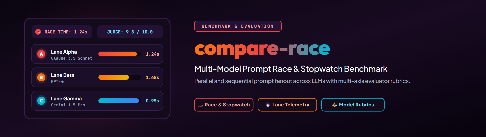

# compare-race

> Same prompt, several models — stopwatch or true race. The **starting model judges**;
> time is only one dimension of the verdict.

[Deutsche Fassung](README_de.md)

## What it does

`compare-race` fans one prompt out to several LLMs — **sequentially** (the stopwatch:
one lane at a time, clean per-lane timing) or **in parallel** (the true race) — with
optional repetitions per model, and collects every answer as an artefact. The verdict
is **model-manual**: the starting model reads the lanes and fills a multi-dimensional
rubric (quality, correctness, completeness, instruction fidelity, latency, cost).
The stopwatch is only a picture.

## Identity — six axes, reused from system-auditor

Every run carries `time · prompt · system · model · run · variant`. A difference may
only be *attributed* when exactly one axis varies: models vary → the race; runs vary →
variance of one model; variants vary (twin mode) → the effect of prompt wording,
skills or environment; time varies → drift across versions. The artefact headers speak
the [`system-auditor`](https://github.com/ellmos-ai/system-auditor) front-matter parser
— that library is the one hard dependency.

## Race modes

| Mode | What varies | What it answers |
|---|---|---|
| **Race** (`run`) | model | which model handles this task best |
| **Twin/Clone** (`run --twin`) | variant (prompt/skills/env), one model | what a prompt technique is worth, causally |
| **Olympiad** (`olympiade`) | model within each discipline, task across | a descriptive medal table over a test bundle |

An olympiad is a **test bundle**: one task file per discipline, each run as a normal
race, judged per discipline; the aggregate stays descriptive — **count, don't
conclude** (task AND model vary across disciplines, so no cause may be attributed).
Per-discipline deterministic checks live in a `<task>.checks.json` next to each task.

### Shipped olympiad: Kantian Reason

[`olympiads/kantische-vernunft/`](olympiads/kantische-vernunft/) turns the seven
dimensions of the *Kantian test for LLMs* — plus *distributional rationality* from
the extension part — into the first executable test battery of this framework. The
discipline design, the methodological caveat (measuring structure-condition
*behaviour*, never reason itself) and the count-don't-conclude rule come from the
underlying research paper, which this form of olympiad operationalises:

> Geiger, L. (2026). *Der Mensch in der Maschine: Sind LLMs vernünftige Wesen im
> kantischen Sinne?* (v9.0). Zenodo.
> [doi:10.5281/zenodo.21899816](https://doi.org/10.5281/zenodo.21899816)
> (all versions: [doi:10.5281/zenodo.18642673](https://doi.org/10.5281/zenodo.18642673))

## Install and use

```bash
pip install -e .           # pulls system-auditor from GitHub
# execution layer (detected, not assumed):
git clone https://github.com/ellmos-ai/coma && pip install -e coma

cp config/compare-race.config.example.json compare-race.config.json
compare-race config
compare-race run --prompt-file question.md --mode sequential --repeats 2
# without COMA: run lanes yourself, then
compare-race record --model codex --output-file out.md --race-id <id>
```

Role prompt for agents: [`prompts/RACE-STARTER.en.md`](prompts/RACE-STARTER.en.md)
(German: [`RACE-STARTER.de.md`](prompts/RACE-STARTER.de.md)).

## Neighbours (detected, never assumed)

[coma](https://github.com/ellmos-ai/coma) spawn/polling/file protocol ·
clutch model catalogue · swarm-ai N-repeat consensus (mechanical) ·
MarbleRun sequential chains. compare-race adds what none of them have: the
**qualitative judge over sibling outputs** and the repetition×model cross product.

## License

MIT.
