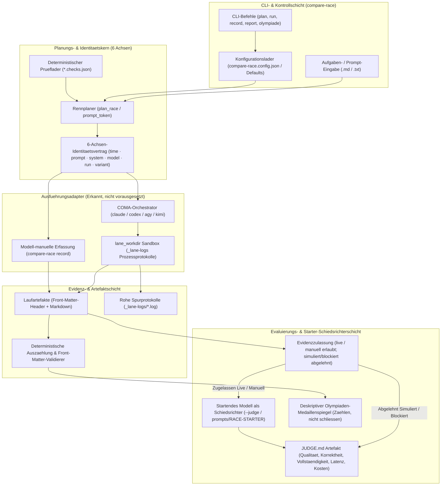
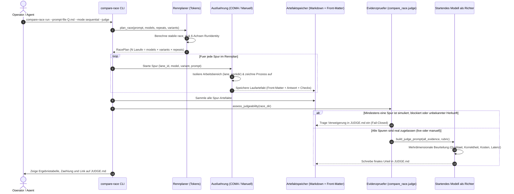

<!-- alternate banner: assets/banner-b.png (swap on occasion) -->

# compare-race

[](pyproject.toml)
[](.github/workflows/ci.yml)
[](tests/)
[](pyproject.toml)
[](pyproject.toml)
[](https://github.com/astral-sh/ruff)
[](THIRD_PARTY_LICENSES.md)
[](SECURITY.md)
[](SECURITY.md)
[](THIRD_PARTY_LICENSES.md)
[](MARKETING-LOG.txt)
[](LICENSE)
[](https://github.com/ellmos-ai)
[](https://github.com/open-bricks)
[](llms.txt)

> Selber Prompt, mehrere Modelle — Stoppuhr oder echtes Rennen. Das **startende Modell
> urteilt**; Zeit ist nur eine Dimension des Urteils.

[English version](README.md)

---

## Schnellnavigation

1. [Kernkonzept & Identität](#kernkonzept--identität)
2. [Visuelle Architektur-Topologie & Entkoppelte Schichten](#systemarchitektur)
3. [End-to-End Renn-Lebenszyklus & Starter-Judge](#end-to-end-renn-lebenszyklus)
4. [Zielgruppen & High-Intent Suchanfragen](#zielgruppen--suchanfragen)
5. [Vergleichsmatrix gegenüber Alternativen](#vergleichsmatrix--alternativen)
6. [Governance- & Laufzeit-Invarianten](#governance---laufzeit-invarianten)
7. [Race-, Twin- & Olympiaden-Modi](#race--twin---olympiaden-modi)
8. [Kantische Vernunft Olympiade](#kantische-vernunft-olympiade)
9. [Evidenzbewusster Starter-Judge](#evidenzbewusster-starter-judge)
10. [Installation & Voraussetzungen](#installation--ausführung)
11. [CLI-Befehlsreferenz](#cli-befehlsreferenz)
12. [Konfiguration & Rollen-Prompts](#konfiguration--rollen-prompts)
13. [Geschwister-Ökosystem-Matrix](#geschwister-ökosystem-matrix)
14. [Drittanbieter-Lizenzen & Level 1 SBOM](#drittanbieter-lizenzen--transparenz)
15. [Sicherheitsrichtlinie & Betriebliche Grenzen](#sicherheit--sla)
16. [Testing, Verifikation & CI-Matrix](#testing--verifikation)
17. [Auffindbarkeit & Disambiguierung](#auffindbarkeit--llm-kontext)
18. [Gesetzlicher Hinweis, Haftungsbeschränkung & Lizenz (§ 521 BGB)](#lizenz)

---

<a id="kernkonzept--identität"></a><a id="executive-summary--core-identity"></a>
## 1. Kernkonzept & Identität

`compare-race` schickt einen Prompt an mehrere LLMs — **nacheinander** (die Stoppuhr: eine Spur nach der anderen, saubere Einzelmessung) oder **gleichzeitig** (das echte Rennen) — mit optionalen Wiederholungen je Modell, und sammelt jede Antwort als Artefakt ein. Das Urteil ist **modellmanuell** oder ein ausdrücklicher `--judge`-Aufruf: Das startende Modell liest die Spuren und füllt eine mehrdimensionale Rubrik (Qualität, Korrektheit, Vollständigkeit, Anweisungstreue, Latenz, Kosten). Die Stoppuhr ist nur ein Bild.

Jeder Lauf trägt strikt die 6-Achsen-Identitätsdisziplin aus [`system-auditor`](https://github.com/ellmos-ai/system-auditor):

$$\text{Lauf-Identität} = \text{time} \cdot \text{prompt} \cdot \text{system} \cdot \text{model} \cdot \text{run} \cdot \text{variant}$$

Zugeschrieben werden darf **nur dann**, wenn genau eine Achse variiert:
- **Modelle variieren:** Das Rennen (welches Modell löst diese konkrete Aufgabe am besten).
- **Läufe variieren:** Varianz und stochastische Streuung eines einzelnen Modells über Wiederholungen.
- **Varianten variieren (Twin-Modus):** Die kausale Wirkung von Prompt-Formulierungen, Framings, Skills oder Umgebungen.
- **Zeit variiert:** Modell-Drift über Versionen oder Upstream-API-Änderungen.
- **Systeme variieren:** Hardware-Plattform, Host-Betriebssystem oder lokale Umgebungsunterschiede.

Die Kopfzeilen der Laufartefakte sprechen den kanonischen Parser `system_auditor.report.parse_front_matter` — womit `system-auditor` die einzige feste Laufzeitabhängigkeit bildet.

---

<a id="systemarchitektur"></a><a id="visual-architecture-topology"></a>
## 2. Visuelle Architektur-Topologie & Entkoppelte Schichten

Das folgende Diagramm visualisiert die entkoppelten Schichten von `compare-race`, von der CLI-Verteilung und 6-Achsen-Planung bis zu Ausführungsadaptern, Artefaktspeicherung und evidenzbewusster Beurteilung:



---

<a id="end-to-end-renn-lebenszyklus"></a><a id="sequence-flow"></a>
## 3. End-to-End Renn-Lebenszyklus & Starter-Judge



---

<a id="zielgruppen--suchanfragen"></a><a id="target-personas--discoverability"></a>
## 4. Zielgruppen & High-Intent Suchanfragen

`compare-race` bedient vier zentrale Entwickler- und Forscher-Archetypen:

- **`[PERSONA-01]` KI-Benchmarking-Ingenieure & Evaluierungs-Spezialisten:**
  - *Bedarf:* Direkter Direktvergleich von Sprachmodellen auf domänenspezifischen Prompts mit wiederholbarem, isoliertem Timing, Kostenermittlung und deterministischer Check-Prüfung.
  - *Lösung:* Lokales sequentielles Stoppuhr- oder paralleles Renn-Benchmarking, vollständige Antwortsammlung in Markdown/Front-Matter-Artefakten, deterministische Zählprüfungen und reproduzierbare 6-Achsen-Zuschreibung.
- **`[PERSONA-02]` Multi-Modell Agent-Loop & System-Architekten:**
  - *Bedarf:* Automatisierte Modellauswahl für geschäftskritische Teilaufgaben (Code-Erstellung, Übersetzung, logische Beweisführung) basierend auf objektiven Qualitätsrubriken.
  - *Lösung:* Evidenzbewusster Starter-Judge, der Geschwisterspuren über Qualität, Korrektheit, Vollständigkeit, Befolgungstreue, Latenz und Kosten beurteilt — mit strikter Verweigerung bei synthetischen oder ungesicherten Läufen.
- **`[PERSONA-03]` Prompt-Ingenieure & Alignment- / Twin-Modus-Forscher:**
  - *Bedarf:* Kausale Evaluierung von Prompt-Varianten, System-Prompt-Abstimmungen, Few-Shot-Framing und Skill-Aktivierungen ohne Störvariablen.
  - *Lösung:* Dedizierter Twin/Clone-Modus (`run --twin`), der das Modell fixiert und ausschließlich die Varianten-Achse über Wiederholungen systematisch variiert.
- **`[PERSONA-04]` Enterprise Tooling-, Sicherheits- & Governance-Beauftragte:**
  - *Bedarf:* 100% Offline-Prüfung, null Datenabfluss (Zero-Egress), permissive Lizenzen, unprivilegierte Prozessausführung und garantierte Vertraulichkeit.
  - *Lösung:* 100% Local-First / Zero-Egress (`INV-LOCAL-01`), unprivilegierter `RunAsInvoker`-Betrieb (`INV-SEC-02`), 100% permissive Abhängigkeiten (MIT / PSFL-2.0 auditiert in `THIRD_PARTY_LICENSES.md`), duale Sicherheits-Reaktions-SLAs (48h Erstquittung, 5 Tage Triage).

### High-Intent Suchanfragen (Zweisprachig EN & DE)

| Suchfokus | Deutsche (DE) Suchbegriffe | Englische (EN) Keywords |
|:---|:---|:---|
| **Benchmarking & Rennen** | `LLM Modellvergleich Benchmark Python`, `gleicher Prompt mehrere Modelle`, `Stoppuhr und echtes Rennen fuer Sprachmodelle` | `llm race benchmark python`, `same prompt multi model comparison`, `head to head llm stopwatch` |
| **Schiedsrichter & Rubriken** | `LLM Schiedsrichter Evaluierung`, `Evidenzbewusste LLM Schiedsrichterpruefung`, `qualitative Beurteilung Sprachmodelle` | `llm judge evaluation rubric`, `evidence-aware llm judge refusal`, `multi-dimensional llm scoring` |
| **Kausaler Twin & Olympiade** | `Twin-Modus Promptvergleich kausal`, `Kantische Vernunft Olympiade`, `systematische Prompt-Variation` | `twin prompt comparison causal evaluation`, `kantian reason llm olympiad`, `prompt engineering ablation` |
| **Datenschutz & Sicherheit** | `lokales Modell-Benchmarking Zero-Egress`, `offline Sprachmodell Evaluierung`, `unbevollmaechtigter Benchmark-Lauf` | `local-first model benchmark zero-egress`, `offline llm evaluation tool`, `runasinvoker python benchmark` |

---

<a id="vergleichsmatrix--alternativen"></a><a id="comparative-matrix-vs-alternatives"></a>
## 5. Vergleichsmatrix gegenüber Alternativen

| Technische Dimension | Invarianten-Bezug | compare-race | LMSYS Chatbot Arena | lm-evaluation-harness | Ad-Hoc Python-Skripte |
|:---|:---|:---|:---|:---|:---|
| **Ausführungs-Datenschutz** | `INV-LOCAL-01` | **100% Local-First / Zero-Egress** | Cloud-API / Öffentliches Web | Lokale API-Aufrufe | Ad-hoc / Ungeprüft |
| **Prozessprivilegien** | `INV-SEC-02` | **Unprivilegierter RunAsInvoker** | Cloud Hosted | Unprivilegiert | Meist ungeprüft |
| **Kausale Zuschreibung** | `INV-AXIS-03` | **Strikte 6-Achsen-Disziplin** | Vermischte Aggregatwerte | Starre Metrik-Scores | Vermischte Achsen |
| **Evidenzprüfung** | `INV-JUDGE-04` | **Fail-Closed Zulassung / Verweigerung** | Intransparente Logs | Nicht anwendbar | Keine / Ad-hoc |
| **Arbeitsbereich-Isolation** | `INV-ISOL-05` | **Dedizierte `lane_workdir` Sandbox** | Container-Cloud | In-Prozess-Ausführung | Kollision des Verzeichnisses |
| **Fehlertransparenz** | `INV-FAIL-06` | **Explizite `ok: false` Protokollierung** | Versteckte Timeouts | Stille Wiederholung | Unbehandelte Exceptions |
| **Testbündelung** | `INV-BUNDLE-07` | **Olympiade (Zählen, nicht schließen)** | Nicht anwendbar | Feste Task-Suites | Nicht unterstützt |
| **Geschwister-Integration** | `INV-INTEROP-08` | **Native `ellmos-ai` Adapter** | Proprietäre Plattform | Standalone-Framework | Fragiler Klebecode |
| **Lizenz-Transparenz** | `INV-LIC-09` | **100% Permissiv (MIT / PSFL-2.0)** | Proprietär / Web-Plattform | Apache-2.0 | Lizenzlos |
| **Sicherheits-SLA** | `INV-SLA-10` | **48h Quittung / 5 Werktage Triage** | Cloud ToS | Community Best-Effort | Keine |

---

<a id="governance---laufzeit-invarianten"></a><a id="governance-und-laufzeit-invarianten"></a>
## 6. Governance- & Laufzeit-Invarianten

`compare-race` erfüllt zehn grundlegende Architektur-, Datenschutz- und Sicherheitsinvarianten:

| Invarianten-ID | Titel / Regel | Architektonische Garantie | Durchsetzungsmechanismus |
|:---|:---|:---|:---|
| `INV-LOCAL-01` | **100% Offline / Zero-Egress** | Alle Benchmarks, Zeitmessungen und Bewertungen laufen rein lokal innerhalb der Prozessgrenzen | Null Telemetrie, null Tracking, null externe Netzwerkaufrufe |
| `INV-SEC-02` | **Unprivilegierter User-Mode** | Ausführung als Standard-Benutzer ohne Root- oder Administrator-Rechte | `RunAsInvoker`-Sicherheitsstandard in `SECURITY.md` |
| `INV-AXIS-03` | **6-Achsen-Zuschreibungsdisziplin** | Strikter Identitäts-Tupel: `time · prompt · system · model · run · variant` | Kausale Zuschreibung nur zulässig bei exakt einer variierenden Achse (`system-auditor`) |
| `INV-JUDGE-04` | **Evidenzbewusster Fail-Closed Judge** | Nur echte Live- oder manuell erfasste Daten werden zugelassen | Synthetische oder unvollständige Spuren führen zu Verweigerung in `JUDGE.md` |
| `INV-ISOL-05` | **Sichere Prozess- & Verzeichnis-Isolation** | `lane_workdir` isoliert Ausführungsverzeichnisse und stellt `cwd` zuverlässig wieder her | `try...finally`-Schutz in `modes.py`; isolierte Logs in `_lane-logs` |
| `INV-FAIL-06` | **Transparente Fehlerprotokollierung** | Fehlgeschlagene Spuren werden explizit mit `ok: false` und Fehlerursache erfasst | Dauerhaft im Front-Matter hinterlegt; niemals still verworfen |
| `INV-BUNDLE-07` | **Deskriptive Olympiaden-Trennung** | Disziplinübergreifende Tests bleiben deskriptiv: "Zählen, nicht schließen" | Olympiaden-Aggregator zählt Medaillen ohne unzulässige Kausalschlüsse |
| `INV-INTEROP-08` | **Geschwister-Ökosystem-Kompatibilität** | Native Interoperabilität mit der `ellmos-ai`- und `open-bricks`-Familie | Steckbare Adapter für `coma`, `clutch`, `swarm-ai`, `marblerun` |
| `INV-LIC-09` | **100% Permissiver geprüfter Stack** | 100% freie, permissive Open-Source-Lizenzen (MIT, PSFL-2.0) | Geprüftes Lizenzinventar in `THIRD_PARTY_LICENSES.md` |
| `INV-SLA-10` | **Kryptographische Parität & Sicherheits-SLA** | Vertragstests und zweistufige Sicherheitsreaktionszeiten | 48 Stunden Reaktionszeit, 5 Werktage Triage-Zusage in `SECURITY.md` |

---

<a id="race--twin---olympiaden-modi"></a><a id="race-twin--olympiad-modes"></a>
## 7. Race-, Twin- & Olympiaden-Modi

| Modus | Was variiert | Was er beantwortet | Kausale Zuschreibung |
|:---|:---|:---|:---|
| **Rennen** (`run`) | `model` | Welches Modell löst diese konkrete Aufgabe am besten | Kausal über Modelle |
| **Twin/Klon** (`run --twin`) | `variant` (Prompt/Skills/Env), ein Modell | Was eine Formulierung oder ein Skill kausal bewirkt | Kausal über Varianten |
| **Olympiade** (`olympiade`) | `model` je Disziplin, `task` übergreifend | Deskriptiver Medaillenspiegel über ein gesamtes Testbündel | **Nur deskriptiv** (Zählen, nicht schließen) |

Eine Olympiade ist ein **Testbündel**: Eine Aufgabendatei je Disziplin, jede als reguläres Rennen ausgeführt und je Disziplin geurteilt. Das Aggregat bleibt rein deskriptiv — **zählen, nicht schließen** (da über Disziplinen hinweg sowohl Aufgabe ALS AUCH Modell variieren, ist kein einzelner Kausalschluss mathematisch haltbar). Deterministische Prüfungen liegen in `<task>.checks.json`-Dateien direkt neben den Aufgaben.

---

<a id="kantische-vernunft-olympiade"></a><a id="kantian-reason-olympiad"></a>
## 8. Kantische Vernunft Olympiade

[`olympiads/kantische-vernunft/`](olympiads/kantische-vernunft/) überführt die sieben Dimensionen des *Kantischen Tests für Sprachmodelle* — zuzüglich der *distributionellen Rationalität* aus dem Ergänzungsteil — in die erste ausführbare Testbatterie dieses Frameworks. Das Disziplindesign, der methodische Vorbehalt (Messung von Bedingungsverhalten, niemals der Vernunft selbst) und die Zählen-nicht-schließen-Regel stammen aus der zugrundeliegenden Forschungsarbeit:

> Geiger, L. (2026). *Der Mensch in der Maschine: Sind LLMs vernünftige Wesen im kantischen Sinne?* (v9.0). Zenodo.
> [doi:10.5281/zenodo.21899816](https://doi.org/10.5281/zenodo.21899816) (alle Versionen: [doi:10.5281/zenodo.18642673](https://doi.org/10.5281/zenodo.18642673))

---

<a id="evidenzbewusster-starter-judge"></a><a id="evidence-aware-starter-judge"></a>
## 9. Evidenzbewusster Starter-Judge

Jedes Laufartefakt trägt eine global stabile `lane_id` und eine eindeutige `evidence_kind`:
- `live`: Real ausgeführt über erkannte COMA-Adapter.
- `manual`: Manuell vom Modell erfasst über `compare-race record`.
- `simulated`: Synthetischer Testlauf oder Mock-Ausgabe.
- `blocked`: Ausführung durch Richtlinien oder Berechtigungen übersprungen.
- `failed`: Prozess mit Fehlercode abgebrochen.
- `unknown`: Herkunft konnte nicht verifiziert werden.

Der automatische Starter-Judge (`compare_race.judge`, aufgerufen über `--judge`) folgt dem **Fail-Closed-Zulassungsprinzip**: Er lässt ausschließlich echte `live`- oder `manual`-Evidenz zu. Ist eine Spur simuliert, blockiert oder unklarer Herkunft, wird eine ausdrückliche Verweigerung in `JUDGE.md` protokolliert, statt fehlerhafte Daten zu bewerten.

Der evidenzbewusste Richter wurde unabhängig von Konzepten aus SentinelFleet implementiert; es wurde kein AGPL-Quellcode kopiert (siehe [`docs/SENTINELFLEET-CONCEPT-TRANSFER.md`](docs/SENTINELFLEET-CONCEPT-TRANSFER.md)).

---

<a id="installation--ausführung"></a><a id="installation--prerequisites"></a>
## 10. Installation & Voraussetzungen

### Installation aus dem Quellcode

```bash
# Repository klonen
git clone https://github.com/ellmos-ai/compare-race.git
cd compare-race

# Im Editable-Modus installieren (bezieht system-auditor via Git)
pip install -e .

# Optional: Ausführungsschicht installieren (erkannt, nicht zwingend)
git clone https://github.com/ellmos-ai/coma && pip install -e coma
```

---

<a id="cli-befehlsreferenz"></a><a id="cli-command-reference"></a>
## 11. CLI-Befehlsreferenz

`compare-race` bietet eine einheitliche Befehlszeilenschnittstelle:

```bash
# Lokale Konfiguration aus Beispiel vorlegen
cp config/compare-race.config.example.json compare-race.config.json
compare-race config

# Rennen planen ohne Ausführung (Dry-Run prüft generierte Identitäten)
compare-race plan --prompt-file frage.md --models claude,codex --repeats 2

# Sequentielles Rennen starten (Stoppuhr: saubere Einzelzeitmessung)
compare-race run --prompt-file frage.md --mode sequential --repeats 2

# Paralleles Rennen mit Richter-Beurteilung starten
compare-race run --prompt-file frage.md --mode parallel --judge

# Kausale Twin/Klon-Promptprüfung durchführen (gleiches Modell, Varianten)
compare-race run --prompt-file frage.md --twin --variants basis,cot,fewshot

# Olympiaden-Testbündel ausführen (Mehrdisziplinen-Benchmark)
compare-race olympiade --bundle olympiads/kantische-vernunft

# Modell-manuelle Rückfallebene (ohne COMA manuell aufzeichnen)
compare-race record --model codex --output-file ausgabe.md --race-id <id>

# Berichtsgerüst aus bestehendem Rennverzeichnis erzeugen oder auffrischen
compare-race report --race-dir races/<race-id>
```

---

<a id="konfiguration--rollen-prompts"></a><a id="configuration--role-prompts"></a>
## 12. Konfiguration & Rollen-Prompts

Die Konfiguration wird aus `compare-race.config.json` geladen (oder fällt auf interne Standardwerte zurück). Eine vollständige Vorlage liegt unter [`config/compare-race.config.example.json`](config/compare-race.config.example.json).

Vorgefertigte Rollen-Prompts für autonome Agenten:
- Deutsch: [`prompts/RACE-STARTER.de.md`](prompts/RACE-STARTER.de.md)
- Englisch: [`prompts/RACE-STARTER.en.md`](prompts/RACE-STARTER.en.md)

---

<a id="geschwister-ökosystem-matrix"></a><a id="sibling-tools--ecosystem-matrix"></a>
## 13. Geschwister-Ökosystem-Matrix

`compare-race` fügt sich nahtlos in die Werkzeuge von `ellmos-ai` und `open-bricks` ein:

| Projekt | Rolle im Ökosystem | Schnittstelle zu `compare-race` | Repository-Link |
|:---|:---|:---|:---|
| **system-auditor** | Kanonische Prüfung & Identitätsdisziplin | Liest und verifiziert 6-Achsen-Front-Matter-Header | [ellmos-ai/system-auditor](https://github.com/ellmos-ai/system-auditor) |
| **coma** | Multi-Provider-LLM CLI-Orchestrator | Führt sequentielle und parallele Spuren aus | [dev-bricks/coma](https://github.com/dev-bricks/coma) |
| **clutch** | Modell-Katalog & Preisdatenbank | Liefert Preisangaben für Kostenschätzungen | [ellmos-ai/clutch](https://github.com/ellmos-ai/clutch) |
| **swarm-ai** | Mechanischer Konsens über N Wiederholungen | Komplementär: Mechanische Übereinstimmung vs. qualitative Schiedsrichter | [ellmos-ai/swarm-ai](https://github.com/ellmos-ai/swarm-ai) |
| **marblerun** | Sequentieller Multi-Agenten Kettenläufer | Koordiniert Handoff- und Prüfschleifen | [ellmos-ai/marblerun](https://github.com/ellmos-ai/marblerun) |
| **open-bricks** | Dachorganisation für Open-Source-Werkzeuge | Kanonisches Dach und Governance-Standards | [open-bricks](https://github.com/open-bricks) |

---

<a id="drittanbieter-lizenzen--transparenz"></a><a id="third-party-licenses--level-1-sbom"></a>
## 14. Drittanbieter-Lizenzen & Level 1 SBOM

`compare-race` garantiert **vollständige Freiheit von Copyleft-, GPL- oder AGPL-Abhängigkeiten**. Alle Laufzeit-, optionalen und Entwicklungsabhängigkeiten unterliegen streng permissiven Lizenzen (MIT, PSFL-2.0, Apache-2.0).

Vollständige Level 1 SBOM-Audits, die Invarianten-Matrix und Lizenztexte finden sich in [`THIRD_PARTY_LICENSES.md`](THIRD_PARTY_LICENSES.md) sowie [`NOTICE`](NOTICE).

---

<a id="sicherheit--sla"></a><a id="security-policy--operational-limits"></a>
## 15. Sicherheitsrichtlinie & Betriebliche Grenzen

`compare-race` unterliegt verbindlichen Sicherheitsstandards:
- **Zero-Egress & Lokale Ausführung:** Alle Bewertungen verbleiben auf dem lokalen System.
- **Prozessisolation:** Schutz lokaler Verzeichnisse über `lane_workdir` Sandboxing.
- **Zweistufige Reaktions-SLA:** 48 Stunden Eingangsbestätigung und 5 Werktage Triage-Zusage.

Zur Meldung von Sicherheitslücken siehe [`SECURITY.md`](SECURITY.md).

---

<a id="testing--verifikation"></a><a id="testing-verification--ci-matrix"></a>
## 16. Testing, Verifikation & CI-Matrix

Die Testsuite stellt Vertragstreue, Metadatenhygiene und Renn-Invarianten sicher:

```bash
# Gesamte Testsuite ausführen
pytest

# Detaillierte Ausgabe mit Zusammenfassung
pytest -ra -v

# Linter- und Formatierungsprüfung
ruff check .

# Bytecode-Kompilierung über alle Module prüfen
python -m compileall src tests
```

---

<a id="auffindbarkeit--llm-kontext"></a><a id="discovery-keywords--disambiguation"></a>
## 17. Auffindbarkeit & Disambiguierung

- **LLM-Kontextdatei:** [`llms.txt`](llms.txt) liefert maschinenlesbare Spezifikationen, Invariantenlisten und CLI-Einstiegspunkte.
- **Marketing- & Zielgruppenregister:** [`MARKETING-LOG.txt`](MARKETING-LOG.txt) dokumentiert Personas, zweisprachige Suchbegriffe und Differenzierungsmatrizen.

### Disambiguierungs-Hinweis

`compare-race` unterscheidet sich durch seine 6-Achsen-Identitätsdisziplin, qualitative Richterbeurteilung und lokale Offline-Ausführung klar von Online-Bestenlisten und Spiele-Benchmarks.

---

<a id="lizenz"></a><a id="statutory-notice--liability-limitation"></a>
## 18. Gesetzlicher Hinweis, Haftungsbeschränkung & Lizenz (§ 521 BGB)

### Gesetzlicher Haftungsausschluss (§ 521 BGB Gefälligkeitsrecht)

Dieses Open-Source-Softwareprodukt wird als **unentgeltliche Schenkung** im Sinne der §§ 516 ff. BGB bereitgestellt. Gemäß **§ 521 BGB** ist die Haftung des Urhebers und der Beitragenden auf **Vorsatz und grobe Fahrlässigkeit** beschränkt. Ergänzend gelten die nachstehenden Haftungsausschlüsse der MIT-Lizenz.

Nutzung auf eigenes Risiko. Keine Wartungsverpflichtung, keine Verfügbarkeitszusicherung, keine Gewähr für Fehlerfreiheit oder Eignung für einen bestimmten Einsatzzweck.

### English Summary

This project is an unpaid open-source donation. In accordance with § 521 of the German Civil Code (BGB), liability is restricted strictly to cases of intentional misconduct and gross negligence. Supplemental liability disclaimers are set forth in the MIT License below.

Use entirely at your own risk. No maintenance commitments, no availability guarantees, and no warranties regarding fitness for any particular purpose.

### Lizenz

Lizenziert unter den Bedingungen der [MIT License](LICENSE).
Copyright (c) 2026 Lukas Geiger. Siehe [LICENSE](LICENSE) und [NOTICE](NOTICE) für vollständige Angaben.
Drittanbieter-Lizenzen und Level 1 SBOM-Hinweise sind in [THIRD_PARTY_LICENSES.md](THIRD_PARTY_LICENSES.md) auditiert.
