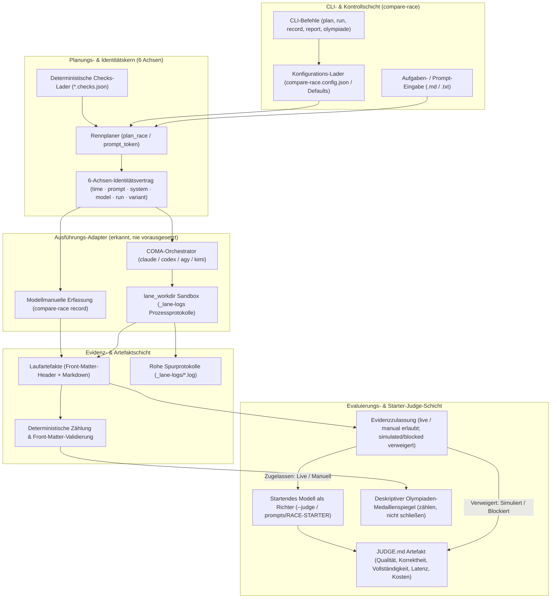
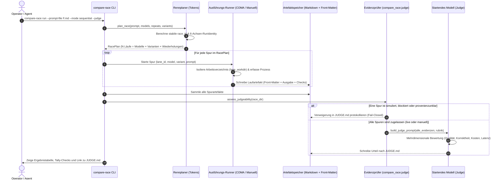

# compare-race

[](pyproject.toml)
[](.github/workflows/ci.yml)
[](tests/)
[](pyproject.toml)
[](pyproject.toml)
[](https://github.com/astral-sh/ruff)
[](THIRD_PARTY_LICENSES.md)
[](SECURITY.md)
[](SECURITY.md)
[](THIRD_PARTY_LICENSES.md)
[](MARKETING-LOG.txt)
[](LICENSE)
[](https://github.com/ellmos-ai)
[](https://github.com/open-bricks)
[](llms.txt)

> Selber Prompt, mehrere Modelle — Stoppuhr oder echtes Rennen. Das **startende Modell
> urteilt**; Zeit ist nur eine Dimension des Urteils.

[English version](README.md)

---

## Schnellnavigation

1. [Kernkonzept & Identität](#kernkonzept--identität)
2. [Systemarchitektur](#systemarchitektur)
3. [Race-, Twin- & Olympiaden-Modi](#race--twin---olympiaden-modi)
4. [Kantische Vernunft Olympiade](#kantische-vernunft-olympiade)
5. [Evidenzbewusster Starter-Judge](#evidenzbewusster-starter-judge)
6. [Governance- & Laufzeit-Invarianten](#governance---laufzeit-invarianten)
7. [Installation & Ausführung](#installation--ausführung)
8. [CLI-Befehlsreferenz](#cli-befehlsreferenz)
9. [Konfiguration & Rollen-Prompts](#konfiguration--rollen-prompts)
10. [Geschwister-Ökosystem-Matrix](#geschwister-ökosystem-matrix)
11. [Drittanbieter-Lizenzen & Transparenz](#drittanbieter-lizenzen--transparenz)
12. [Auffindbarkeit & LLM-Kontext](#auffindbarkeit--llm-kontext)
13. [Testing & Verifikation](#testing--verifikation)
14. [Sicherheit & SLA](#sicherheit--sla)
15. [Lizenz](#lizenz)

---

## Kernkonzept & Identität

`compare-race` schickt einen Prompt an mehrere LLMs — **nacheinander** (die Stoppuhr: eine Spur nach der anderen, saubere Einzelmessung) oder **gleichzeitig** (das echte Rennen) — mit optionalen Wiederholungen je Modell, und sammelt jede Antwort als Artefakt ein. Das Urteil ist **modellmanuell** oder ein ausdrücklicher `--judge`-Aufruf: Das startende Modell liest die Spuren und füllt eine mehrdimensionale Rubrik (Qualität, Korrektheit, Vollständigkeit, Anweisungstreue, Latenz, Kosten). Die Stoppuhr ist nur ein Bild.

Jeder Lauf trägt strikt die 6-Achsen-Identitätsdisziplin aus [`system-auditor`](https://github.com/ellmos-ai/system-auditor):

$$\text{Lauf-Identität} = \text{time} \cdot \text{prompt} \cdot \text{system} \cdot \text{model} \cdot \text{run} \cdot \text{variant}$$

Zugeschrieben werden darf **nur dann**, wenn genau eine Achse variiert:
- **Modelle variieren:** Das Rennen (welches Modell löst diese konkrete Aufgabe am besten).
- **Läufe variieren:** Varianz und stochastische Streuung eines einzelnen Modells über Wiederholungen.
- **Varianten variieren (Twin-Modus):** Die kausale Wirkung von Prompt-Formulierungen, Framings, Skills oder Umgebungen.
- **Zeit variiert:** Modell-Drift über Versionen oder Upstream-API-Änderungen.
- **Systeme variieren:** Abweichungen durch Hardware-Plattformen, Host-Betriebssysteme oder Umgebungen.

Die Artefakt-Köpfe sprechen den kanonischen Parser `system_auditor.report.parse_front_matter` — das ist die einzige harte Laufzeit-Abhängigkeit.

---

## Systemarchitektur

Das folgende Diagramm visualisiert die entkoppelten Schichten von `compare-race`, von der CLI-Steuerung und 6-Achsen-Planung bis zu Ausführungs-Adaptern, Artefakt-Speicher und dem evidenzbewussten Schiedsrichter:



### End-to-End Renn-, Ausführungs- & Judge-Lebenszyklus



---

## Race-, Twin- & Olympiaden-Modi

| Modus | Was variiert | Was er beantwortet | Kausale Zuschreibung |
|:---|:---|:---|:---|
| **Race** (`run`) | `Modell` | Welches Modell diese Aufgabe am besten löst | Kausal über Modelle |
| **Twin/Clone** (`run --twin`) | `Variante` (Prompt/Skills/Umgebung), ein Modell | Was eine Prompt-Technik oder ein Skill kausal wert ist | Kausal über Varianten |
| **Olympiade** (`olympiade`) | `Modell` je Disziplin, `Aufgabe` darüber hinweg | Ein deskriptiver Medaillenspiegel über ein Testbundle | **Rein deskriptiv** (zählen, nicht schließen) |

Eine Olympiade ist ein **Testbundle**: je Disziplin eine Task-Datei, jede als normales Race gefahren und je Disziplin gejudgt. Das Aggregat bleibt deskriptiv — **zählen, nicht schließen** (über Disziplinen hinweg variieren Aufgabe UND Modell gleichzeitig, weshalb mathematisch keine Einzelursache isoliert werden darf). Deterministische Checks je Disziplin liegen als `<task>.checks.json` neben der jeweiligen Task-Datei.

---

## Kantische Vernunft Olympiade

[`olympiads/kantische-vernunft/`](olympiads/kantische-vernunft/) macht aus den sieben Dimensionen des *kantischen Tests für LLMs* — plus *Distributional Rationality* aus dem Erweiterungsteil — die erste ausführbare Testbatterie dieses Rahmenwerks. Das Disziplinen-Design, der methodische Vorbehalt (gemessen wird Strukturbedingungen-*Verhalten*, nie Vernunft selbst) und die Regel „zählen, nicht schließen" stammen aus dem zugrunde liegenden Forschungspaper, das diese Form von Olympiade operationalisiert:

> Geiger, L. (2026). *Der Mensch in der Maschine: Sind LLMs vernünftige Wesen im kantischen Sinne?* (v9.0). Zenodo.
> [doi:10.5281/zenodo.21899816](https://doi.org/10.5281/zenodo.21899816) (alle Versionen: [doi:10.5281/zenodo.18642673](https://doi.org/10.5281/zenodo.18642673))

---

## Evidenzbewusster Starter-Judge

Jedes Laufartefakt trägt eine global stabile `lane_id` und eine ausdrückliche `evidence_kind`:
- `live`: Live über erkannte COMA-Adapter ausgeführt.
- `manual`: Modellmanuell über `compare-race record` erfasst.
- `simulated`: Synthetische Testausgabe oder Mock-Executor.
- `blocked`: Ausführung durch Richtlinien/Rechte übersprungen oder blockiert.
- `failed`: Prozess mit Fehler oder ungleich null beendet.
- `unknown`: Provenienz konnte nicht verifiziert werden.

Der automatische Richter (`compare_race.judge`, aufgerufen über `--judge`) arbeitet nach einem **fail-closed Zulassungsprinzip**: Er lässt nur echte `live`- oder `manual`-Evidenz zu. Ist eine Spur simuliert, blockiert oder provenienzunklar, protokolliert er eine belegte Verweigerung in `JUDGE.md`, anstatt ungesicherte Daten zu bewerten.

Der evidenzbewusste Judge wurde anhand beobachteter SentinelFleet-Konzepte eigenständig implementiert; AGPL-Quellcode wurde nicht kopiert (siehe [`docs/SENTINELFLEET-CONCEPT-TRANSFER.md`](docs/SENTINELFLEET-CONCEPT-TRANSFER.md)).

---

## Governance- & Laufzeit-Invarianten

`compare-race` erfüllt zehn verbindliche Architektur-, Datenschutz- und Sicherheitsinvarianten:

| Invarianten-ID | Titel / Regel | Architektonische Garantie | Durchsetzungs-Mechanismus |
|:---|:---|:---|:---|
| `INV-LOCAL-01` | **100% Offline / Zero-Egress** | Alle Modell-Benchmarking-, Zeitmessungs- und Urteilsprozesse laufen lokal | Null Telemetrie, kein Tracking, keine externen Netzwerkaufrufe |
| `INV-SEC-02` | **Unprivilegierter User-Modus** | Ausführung im Standard-Benutzerkontext ohne Root- oder Admin-Rechte | `RunAsInvoker`-Sicherheitsstandard in `SECURITY.md` |
| `INV-AXIS-03` | **6-Achsen-Attributionsdisziplin** | Verbindliches Identitätstupel: `time · prompt · system · model · run · variant` | Zuschreibungen nur bei Variation von exakt einer Achse (`system-auditor`) |
| `INV-JUDGE-04` | **Evidenzbewusster Fail-Closed Judge** | Nur live ausgeführte oder manuell erfasste Evidenz wird zugelassen | Protokollierte Verweigerung in `JUDGE.md` bei simulierten/blockierten Spuren |
| `INV-ISOL-05` | **Sichere Prozess- & Verzeichnis-Isolation** | `lane_workdir` isoliert Ausführungsverzeichnisse und stellt `cwd` sicher wieder her | `try...finally`-Kapselung in `modes.py`; Logs unter `_lane-logs` |
| `INV-FAIL-06` | **Transparente Spur-Abrechnung** | Fehlgeschlagene Spuren werden explizit mit `ok: false` dokumentiert | Dauerhafte Erfassung im Front-Matter; niemals stillschweigend verworfen |
| `INV-BUNDLE-07` | **Deskriptive Olympiaden-Trennung** | Mehrdisziplinäre Benchmarks bleiben deskriptiv: „zählen, nicht schließen" | Olympiaden-Aggregator zählt Medaillenspiegel ohne falsche Kausalansprüche |
| `INV-INTEROP-08` | **Geschwister-Ökosystem-Kompatibilität** | Nahtlose Integration mit Werkzeugen von `ellmos-ai` und `open-bricks` | Schnittstellen für `coma`, `clutch`, `swarm-ai`, `marblerun` |
| `INV-LIC-09` | **100% Permissiver geprüfter Stack** | Ausschließlich permissive Open-Source-Lizenzen (MIT, PSFL-2.0) | Auditierte Abhängigkeitsmatrix in `THIRD_PARTY_LICENSES.md` |
| `INV-SLA-10` | **Kryptografische Parität & Sicherheits-SLA** | Vertragstest-Verifikation mit zweistufigem Sicherheits-Reaktions-SLA | 48-Stunden-Rückmeldung und 5-Tage-Triage in `SECURITY.md` |

---

## Installation & Ausführung

### Installation aus dem Quellcode

```bash
# Repository klonen
git clone https://github.com/ellmos-ai/compare-race.git
cd compare-race

# Im Editable-Modus installieren (bezieht system-auditor via GitHub)
pip install -e .

# Optional: Ausführungsschicht installieren (erkannt, nie vorausgesetzt)
git clone https://github.com/ellmos-ai/coma && pip install -e coma
```

---

## CLI-Befehlsreferenz

`compare-race` bietet eine einheitliche CLI-Schnittstelle:

```bash
# Lokale Konfiguration aus der Vorlage initialisieren
cp config/compare-race.config.example.json compare-race.config.json
compare-race config

# Rennen planen ohne Ausführung (Dry-Run prüft erzeugte Laufidentitäten)
compare-race plan --prompt-file frage.md --models claude,codex --repeats 2

# Sequenzielles Rennen ausführen (die Stoppuhr: saubere Einzelzeitmessung)
compare-race run --prompt-file frage.md --mode sequential --repeats 2

# Paralleles Rennen mit Richter-Bewertung ausführen
compare-race run --prompt-file frage.md --mode parallel --judge

# Kausale Twin/Clone-Prompt-Evaluierung ausführen (gleiches Modell, variierende Varianten)
compare-race run --prompt-file frage.md --twin --variants base,cot,fewshot

# Olympiaden-Testbundle ausführen (mehrdisziplinäre Evaluierung)
compare-race olympiade --bundle olympiads/kantische-vernunft

# Modellmanuelle Erfassung (ohne COMA: Spuren manuell ausführen und einpflegen)
compare-race record --model codex --output-file out.md --race-id <id>

# Bericht-Scaffold für ein bestehendes Rennverzeichnis erstellen oder aktualisieren
compare-race report --race-dir races/<race-id>
```

---

## Konfiguration & Rollen-Prompts

Die Konfiguration wird aus `compare-race.config.json` geladen (oder greift auf integrierte Standardwerte zurück). Eine vollständige Vorlage liegt unter [`config/compare-race.config.example.json`](config/compare-race.config.example.json).

Vorgefertigte Rollen-Prompts für autonome Agenten:
- Deutsch: [`prompts/RACE-STARTER.de.md`](prompts/RACE-STARTER.de.md)
- Englisch: [`prompts/RACE-STARTER.en.md`](prompts/RACE-STARTER.en.md)

---

## Geschwister-Ökosystem-Matrix

`compare-race` integriert sich nahtlos in die benachbarten Rahmenwerke des `ellmos-ai`- und `open-bricks`-Ökosystems:

| Projekt | Rolle im Ökosystem | Integration mit `compare-race` | Repository-Link |
|:---|:---|:---|:---|
| **system-auditor** | Kanonische Auditierung & Identitätsdisziplin | Parst 6-Achsen-Front-Matter-Laufköpfe | [ellmos-ai/system-auditor](https://github.com/ellmos-ai/system-auditor) |
| **coma** | Multi-Provider LLM-CLI-Orchestrator | Führt sequenzielle und parallele Modellspuren aus | [dev-bricks/coma](https://github.com/dev-bricks/coma) |
| **clutch** | Modellkatalog & Preisdatenbank | Liefert Raten zur automatischen Kostenschätzung | [ellmos-ai/clutch](https://github.com/ellmos-ai/clutch) |
| **swarm-ai** | N-Wiederholungs-Konsensmaschine | Komplementär: Mechanischer Konsens vs. qualitative Bewertung | [ellmos-ai/swarm-ai](https://github.com/ellmos-ai/swarm-ai) |
| **marblerun** | Sequenzieller Multi-Agenten-Kettenläufer | Orchestriert Worker-Reviewer-Controller-Schleifen | [ellmos-ai/marblerun](https://github.com/ellmos-ai/marblerun) |
| **open-bricks** | Dachorganisation für Open-Source-Tools | Kanonische Dachorganisation und gemeinsame Richtlinien | [open-bricks](https://github.com/open-bricks) |

---

## Drittanbieter-Lizenzen & Transparenz

`compare-race` garantiert **vollständige Freiheit von Copyleft-, GPL- oder AGPL-Abhängigkeiten**. Alle Laufzeit-, optionalen und Entwicklungs-Tools sind unter permissiven Open-Source-Lizenzen freigegeben (MIT, PSFL-2.0, Apache-2.0).

Vollständige Audits, Abhängigkeitslisten und Lizenztexte finden sich in [`THIRD_PARTY_LICENSES.md`](THIRD_PARTY_LICENSES.md).

---

## Auffindbarkeit & LLM-Kontext

- **LLM-Kontextdatei:** [`llms.txt`](llms.txt) liefert strukturierte Spezifikationen, Invariantenlisten und API-Einstiegspunkte für LLM-Agenten.
- **Marketing- & Personas-Register:** [`MARKETING-LOG.txt`](MARKETING-LOG.txt) dokumentiert Ziel-Personas, zweisprachige Suchbegriffe und Wettbewerbsdifferenzierungs-Matrizen.

---

## Testing & Verifikation

Die Testsuite stellt Vertragskonformität, Metadatenhygiene und Renn-Orchestrierungs-Invarianten sicher:

```bash
# Gesamte Testsuite ausführen
pytest

# Detaillierter Testlauf mit Fehlerübersicht
pytest -ra -v

# Linting- und Formatierungsprüfung durchführen
ruff check .

# Bytecode-Kompilierung prüfen
python -m compileall src tests
```

---

## Sicherheit & SLA

Für `compare-race` gelten definierte Sicherheitsrichtlinien:
- **Zero-Egress & Lokale Ausführung:** Evaluierung findet vollständig lokal ohne Telemetrie statt.
- **Prozessisolation:** Schutz des Arbeitsverzeichnisses über `lane_workdir`-Sandboxing.
- **Zweistufiges SLA:** Bestätigung von Sicherheitsmeldungen innerhalb von 48 Stunden, Triage binnen 5 Werktagen.

Details zur Sicherheitsrichtlinie und Kontaktmöglichkeiten sind in [`SECURITY.md`](SECURITY.md) hinterlegt.

---

## Lizenz

Dieses Projekt ist unter der [MIT-Lizenz](LICENSE) lizenziert.
